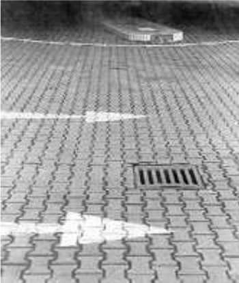
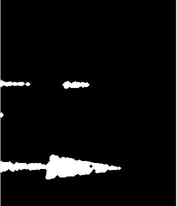

# Arrow Detection

## Description
An Image Processing application developed in Python for Arrow Detection.

## Modules
- Media: source for input picture
- `main.py`: the code

## Workflow
Input Image:  

Binarised Image:  

After Closing:  

After Opening (Final):  

